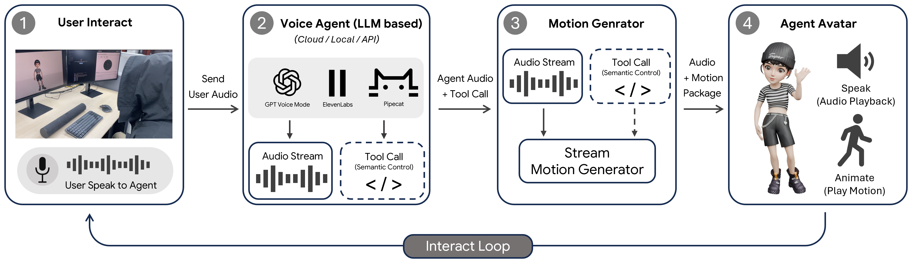
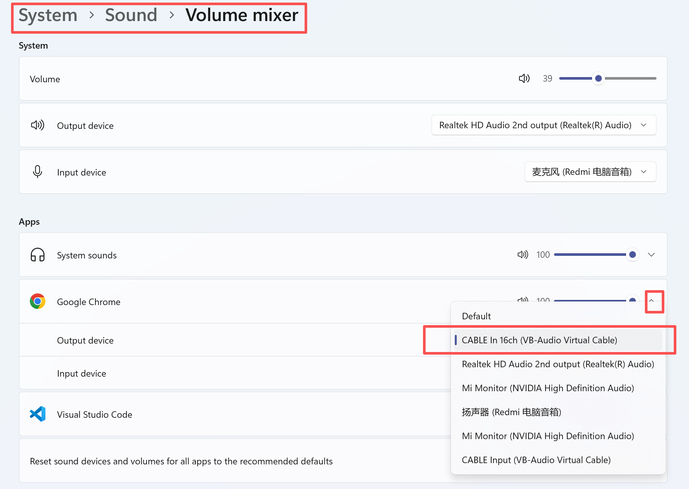
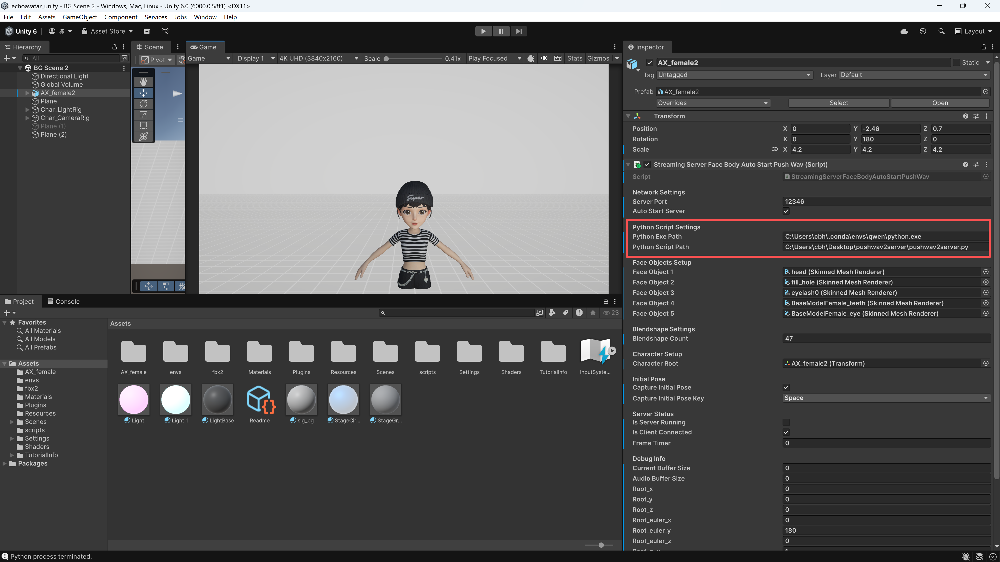

# EchoAvatar: Real-time Generative Avatar Animation from Audio Streams

<center>
  <a href="https://robinwitch.github.io/EchoAvatar-Page/">Project Page</a> 
  <a href="https://arxiv.org/abs/2605.28272">Arxiv Paper</a> •
  <a href="https://youtu.be/GydR3H6YwBQ">Demo Video</a> •
  <a href="#citation">Citation</a>
</center>

## Release Plans

- [x] Real-time deployment code.
- [] Code for evaluating BEATv2 benchmark results.
- [] Training code.


## Environment Setup

We recommend using Conda with Python 3.13:

```bash
conda create -n echoavatar python=3.13
conda activate echoavatar
pip install -r requirements.txt
```

If you run the real-time deployment across two machines, install this environment on the Ubuntu inference server. On the local Windows machine, only the following packages are required:

```bash
pip install sounddevice keyboard huggingface_hub
```

## Checkpoints

Download the checkpoints into the repository root before running inference:

```bash
hf download robinwitch/EchoAvatar --local-dir . --include "ckpts/**"
```

## Real-time deployment

This section describes how to deploy the real-time inference pipeline. After the pipeline is running, audio from a browser or another local application can drive the avatar in Unity. We recommend first verifying the browser-audio workflow below, then connecting a voice agent to the same virtual-audio path.



### 1. Overview

The deployment has two sides:

- **Local Windows machine**: runs Unity, receives audio from the browser or voice agent, and uses `tools/pushwav2server.py` to stream audio to the server.
- **Ubuntu inference server**: runs the audio-to-motion inference script, receives the audio stream, generates face/body motion, and sends motion data back to Unity.

The basic data flow is:

```text
Browser / voice agent audio output
  -> VB-CABLE virtual audio device
  -> Unity calls tools/pushwav2server.py
  -> Ubuntu audio-to-motion inference server
  -> Unity receives motion data and drives the avatar
```

Recommended setup:

- Local side: Windows machine.
- Server side: Ubuntu server with NVIDIA GPU. For simultaneous face and body generation, we recommend dual RTX 3090 or better. If you only generate face motion or only body motion, one GPU is enough.

### 2. Windows setup

#### 2.1 Install a virtual audio device

Install [VB-CABLE](https://vb-audio.com/Cable/). It is used to capture audio from the browser or another system application so that the streaming script can read it later.

#### 2.2 Route browser audio to VB-CABLE

Using Chrome as an example, open:

```text
Settings -> Sound -> Volume mixer -> Apps
```

Find `Google Chrome` and set its output device to:

```text
CABLE In 16ch (VB-Audio Virtual Cable)
```

Example:



If Chrome does not appear in the app list, open a webpage and play audio in Chrome first. Windows may only show Chrome in the mixer after it starts producing audio.

#### 2.3 Prepare the audio streaming tools

Copy the local repository `tools` directory to the Windows machine. Unity will call scripts from this directory, including `tools/pushwav2server.py`, to stream local audio to the Ubuntu inference server.

Then list the local audio devices:

```bash
python tools/get_device.py
```

Find the device whose name contains:

```text
CABLE Output (VB-Audio Virtual Cable)
```

Record its device index and edit `tools/pushwav2server.py`:

- Set `SERVER_IP` (Line 6) to the Ubuntu inference server IP.
- Set `input_device_index` (Line 8) to the device index of `CABLE Output`. The default example value is `2`, but it may be different on your machine.


#### 2.4 Configure the Unity project

Download the Unity package to the Windows machine:

```bash
hf download robinwitch/EchoAvatar --local-dir . --include "echoavatar_unity.zip"
```

Unzip `echoavatar_unity.zip`, then open Unity Hub and choose:
`Add project from disk`

The project uses Unity Editor `6000.0.58f1 (LTS)`.

In the Unity panel, set:

- `Python Exe Path`: path to the local `python.exe`.
- `Python Script Path`: path to `tools/pushwav2server.py`.

Example:



Adjust the paths according to your local environment. When Unity enters the streaming workflow, it will call this script and send audio from VB-CABLE to the server.

### 3. Ubuntu server setup

Run the audio-to-motion inference script on the server:

```text
scripts/5_streaming_vllm_unity_30fps_bp_attn4_encodec2_multirvq_nbc512_motionexample_withface_ik.py
```

Before launching it:

1. Set `MOTION_SERVER_HOST` (Line 41) to the IP address of the machine running Unity. After generating motion, the inference script connects to this address and sends motion data back to Unity.
2. Make sure port `12345` on the Ubuntu server is reachable from the Windows machine. This port receives audio from `tools/pushwav2server.py`.
3. Make sure the required checkpoints exist, for example `./ckpts/body_g` or `./ckpts/body_g_d`.

`MOTION_SERVER_PORT` (Line 45) defaults to `12346` and usually does not need to be changed.

If you also want semantic action control, make sure port `12346` on the Ubuntu server is reachable. In the inference script, this is `TEXT_SERVER_PORT` (Line 726). You can ignore this when only testing browser-audio driving.

### 4. Launch order

#### 4.1 Start Unity

Start the Unity application on the Windows machine first and enter Play mode. The Unity-side motion receiver should be ready before the server script tries to connect to it.

#### 4.2 Start the server inference script

For speech-to-gesture only, run:

```bash
python scripts/5_streaming_vllm_unity_30fps_bp_attn4_encodec2_multirvq_nbc512_motionexample_withface_ik.py --model_name ./ckpts/body_g
```

This mode does not require a specific speech timbre.

For both speech-to-gesture and music-to-dance, run:

```bash
python scripts/5_streaming_vllm_unity_30fps_bp_attn4_encodec2_multirvq_nbc512_motionexample_withface_ik.py --model_name ./ckpts/body_g_d
```

Due to current dataset limitations, speech audio in this mode should be close to the training-data timbre. We recommend voice cloning with the female ZeroEGGS sample: `tools/015_Happy_4_x_1_0.wav`

Music audio has no specific timbre or genre requirement.


### 5. Optional: semantic action control

Only configure this step if you need semantic control. The script can run on the Windows machine or on any other machine that can access port `12346` on the Ubuntu inference server.

Before running it, edit `tools/action_send.py` and set `ACTION_SERVER_HOST` (Line 10) to the Ubuntu inference server IP.

Then send predefined semantic action signals with:

```bash
python tools/action_send.py
```

### 6. Voice agent integration

After the browser-audio workflow is verified, you can connect a voice agent. Whether you use a cloud API or a local deployment, the key requirement is the same: the voice agent's final audio output must be routed to VB-CABLE.

Options:

- Cloud API: ElevenLabs is recommended. It supports voice cloning and does not require extra local GPUs, but usually requires a paid subscription. See [ElevenLabs voice agent setup](docs/elevenlabs_voice_agent_setup.md).
- Local deployment: Pipecat can be used, but it usually requires additional GPU resources. See [Pipecat setup](docs/pipecat.md).

Timbre requirements depend on the model:

- If you only need speech-to-gesture, the TTS voice does not need a specific timbre.
- If you need both speech-to-gesture and music-to-dance in the streaming process, we recommend cloning a female ZeroEGGS voice for speech TTS. The recommended reference audio is `tools/015_Happy_4_x_1_0.wav`.


## Citation

If you find our code or paper helps, please consider citing:

```bibtex
@inproceedings{chen2026echo,
  author = {Bohong Chen and Yumeng Li and Yinglin Xu and Youyi Zheng and Yanlin Weng and Kun Zhou},
  title = {EchoAvatar: Real-time Generative Avatar Animation from Audio Streams},
  year = {2026},
  isbn = {9798400725548},
  publisher = {Association for Computing Machinery},
  address = {New York, NY, USA},
  url = {https://doi.org/10.1145/3799902.3811066},
  doi = {10.1145/3799902.3811066},
  booktitle = {Proceedings of the Special Interest Group on Computer Graphics and Interactive Techniques Conference Conference Papers},
  series = {SIGGRAPH Conference Papers '26}
}
```


## Acknowledgments
Thanks to [EMAGE](https://github.com/PantoMatrix/PantoMatrix), [ZeroEGGS](https://github.com/ubisoft/ubisoft-laforge-ZeroEGGS), [MotoricaDanceDataset](https://github.com/simonalexanderson/MotoricaDanceDataset), [motorica-retarget
](https://github.com/orangeduck/motorica-retarget),[zeroeggs-retarget
](https://github.com/orangeduck/zeroeggs-retarget) , [torchtune](https://github.com/meta-pytorch/torchtune), [ichigo](https://github.com/menloresearch/ichigo),  [T2M-GPT](https://github.com/Mael-zys/T2M-GPT), [MoMask](https://github.com/EricGuo5513/momask-codes), [MECo]([MECo](https://github.com/RobinWitch/MECo)), [verl](https://github.com/verl-project/verl), [vLLM](https://github.com/vllm-project/vllm),[encodec](https://github.com/facebookresearch/encodec), our code is partially borrowing from them. Please check these useful repos.